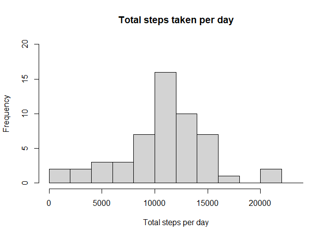
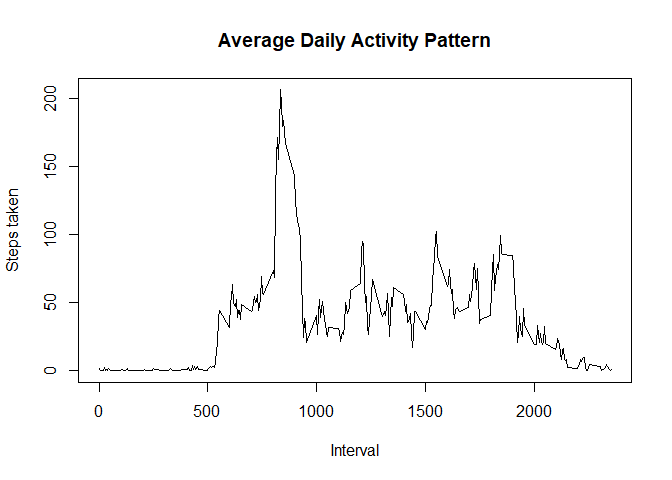
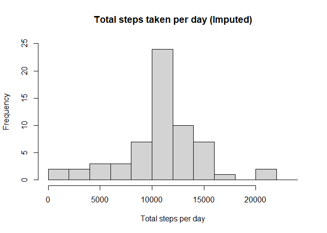
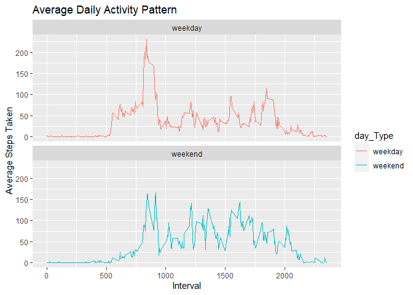

## Introduction

This assignment makes use of data from a personal activity monitoring device. This device collects data at 5 minute intervals through out the day. The data consists of two months of data from an anonymous individual collected during the months of October and November, 2012 and include the number of steps taken in 5 minute intervals each day.

The variables included in dataset are:

* steps: Number of steps taking in a 5-minute interval (missing values are coded as NA)
* date: The date on which the measurement was taken in YYYY-MM-DD format
* interval: Identifier for the 5-minute interval in which measurement was taken

## Load the data


```r
data <- read.csv("activity.csv")
```

## Calculate the total number of steps per day


```r
steps_PerDay <- aggregate(data$steps, list(data$date), FUN=sum)
colnames(steps_PerDay) <- c("Date", "No. of steps")
knitr::kable(steps_PerDay, align = "c")
```


|    Date    | No. of steps |
|:----------:|:------------:|
| 2012-10-01 |      NA      |
| 2012-10-02 |     126      |
| 2012-10-03 |    11352     |
| 2012-10-04 |    12116     |
| 2012-10-05 |    13294     |
| 2012-10-06 |    15420     |
| 2012-10-07 |    11015     |
| 2012-10-08 |      NA      |
| 2012-10-09 |    12811     |
| 2012-10-10 |     9900     |
| 2012-10-11 |    10304     |
| 2012-10-12 |    17382     |
| 2012-10-13 |    12426     |
| 2012-10-14 |    15098     |
| 2012-10-15 |    10139     |
| 2012-10-16 |    15084     |
| 2012-10-17 |    13452     |
| 2012-10-18 |    10056     |
| 2012-10-19 |    11829     |
| 2012-10-20 |    10395     |
| 2012-10-21 |     8821     |
| 2012-10-22 |    13460     |
| 2012-10-23 |     8918     |
| 2012-10-24 |     8355     |
| 2012-10-25 |     2492     |
| 2012-10-26 |     6778     |
| 2012-10-27 |    10119     |
| 2012-10-28 |    11458     |
| 2012-10-29 |     5018     |
| 2012-10-30 |     9819     |
| 2012-10-31 |    15414     |
| 2012-11-01 |      NA      |
| 2012-11-02 |    10600     |
| 2012-11-03 |    10571     |
| 2012-11-04 |      NA      |
| 2012-11-05 |    10439     |
| 2012-11-06 |     8334     |
| 2012-11-07 |    12883     |
| 2012-11-08 |     3219     |
| 2012-11-09 |      NA      |
| 2012-11-10 |      NA      |
| 2012-11-11 |    12608     |
| 2012-11-12 |    10765     |
| 2012-11-13 |     7336     |
| 2012-11-14 |      NA      |
| 2012-11-15 |      41      |
| 2012-11-16 |     5441     |
| 2012-11-17 |    14339     |
| 2012-11-18 |    15110     |
| 2012-11-19 |     8841     |
| 2012-11-20 |     4472     |
| 2012-11-21 |    12787     |
| 2012-11-22 |    20427     |
| 2012-11-23 |    21194     |
| 2012-11-24 |    14478     |
| 2012-11-25 |    11834     |
| 2012-11-26 |    11162     |
| 2012-11-27 |    13646     |
| 2012-11-28 |    10183     |
| 2012-11-29 |     7047     |
| 2012-11-30 |      NA      |

```r
steps_Total <- tapply(data$steps, data$date, FUN=sum)
hist(steps_Total, breaks = seq(0,25000, by=2000), main = "Total steps taken per day", 
     xlab = "Total steps per day", ylim = c(0,20), xlim = c(0,24000))
```

<!-- -->

```r
sprintf("MEAN: %.2f", mean(steps_Total, na.rm=TRUE))
```

```
## [1] "MEAN: 10766.19"
```

```r
sprintf("MEDIAN: %.2f", median(steps_Total, na.rm=TRUE))
```

```
## [1] "MEDIAN: 10765.00"
```
## Average Daily Activity pattern


```r
average_DailyActivity <- aggregate(data$steps, by=list(data$interval), FUN=mean, na.rm=TRUE)
names(average_DailyActivity) <- c("Interval", "Mean")
plot(average_DailyActivity$Interval, average_DailyActivity$Mean,
     main = "Average Daily Activity Pattern", type = "l",
     xlab = "Interval", ylab = "Steps taken")
```

<!-- -->

```r
sprintf("MAX number of steps(%.0f) at Interval %0.f",max(average_DailyActivity$Mean),
        average_DailyActivity[which.max(average_DailyActivity$Mean), ]$Interval)
```

```
## [1] "MAX number of steps(206) at Interval 835"
```
## Imputing Missing Data
There are many days/intervals where there are missing values (coded as NA). The presence of missing days may introduce bias into some calculations or summaries of the data.


1. Calculate and report the total number of missing values in the dataset (i.e. total number of rows with NAs)

```r
sprintf("Total number of entries with missing values: %.0f", sum(is.na(data$steps)))
```

```
## [1] "Total number of entries with missing values: 2304"
```
2. Use the mean per interval to fill in missing values

```r
missing_Steps <- average_DailyActivity$Mean[match(data$interval, average_DailyActivity$Interval)]
```
3. Create a new dataset that is equal to the original dataset but with the missing data filled in

```r
data_Imputed <- transform(data, steps = ifelse(is.na(data$steps), yes = missing_Steps, no = data$steps))
```
4. Make a histogram of the total number of steps taken each day and Calculate and report the mean and median total number of steps taken per day.

```r
steps_Total_Imputed <- tapply(data_Imputed$steps, data_Imputed$date, FUN=sum)
hist(steps_Total_Imputed, breaks = seq(0,25000, by=2000), main = "Total steps taken per day (Imputed)", 
     xlab = "Total steps per day", ylim = c(0,25), xlim = c(0,24000))
```

<!-- -->

```r
mean_Imputed <- mean(steps_Total_Imputed, na.rm=TRUE)
sprintf("MEAN: %.2f. CHANGE: %+3.2f", mean_Imputed,(mean_Imputed-(mean(steps_Total, na.rm=TRUE))))
```

```
## [1] "MEAN: 10766.19. CHANGE: +0.00"
```

```r
median_Imputed <- median(steps_Total_Imputed, na.rm=TRUE)
sprintf("MEDIAN: %.2f. CHANGE: %+3.2f", median_Imputed,(median_Imputed-(median(steps_Total, na.rm=TRUE))))
```

```
## [1] "MEDIAN: 10766.19. CHANGE: +1.19"
```
There was no change between the original and imputed means, since the mean values themselves were used to fill the missing data, while the imputed median became the same as the mean value.

## Activity Pattern difference between weekdays and weekends
1. Create a new factor variable in the dataset with two levels - "weekday" and "weekend" indicating whether a given date is a weekday or weekend day

```r
data_Imputed$RealDate <- as.Date(data_Imputed$date, format = "%Y-%m-%d")
data_Imputed$weekday <- weekdays(data_Imputed$RealDate)
data_Imputed$day_Type <- ifelse(data_Imputed$weekday=='Saturday' | data_Imputed$weekday=='Sunday', 'weekend','weekday')
```
2. Make a panel plot containing a time series plot (i.e. type = "l") of the 5-minute interval (x-axis) and the average number of steps taken, averaged across all weekday days or weekend days (y-axis).

```r
average_DailyActivity_byType <- aggregate(steps~interval+day_Type,data_Imputed,mean,na.action=na.omit)

library(ggplot2)
plot<- ggplot(average_DailyActivity_byType, aes(x = interval , y = steps, color = day_Type)) + geom_line() +
       labs(title = "Average Daily Activity Pattern", x = "Interval", y = "Average Steps Taken") +
       facet_wrap(~day_Type, ncol = 1, nrow=2)
print(plot)
```

<!-- -->
